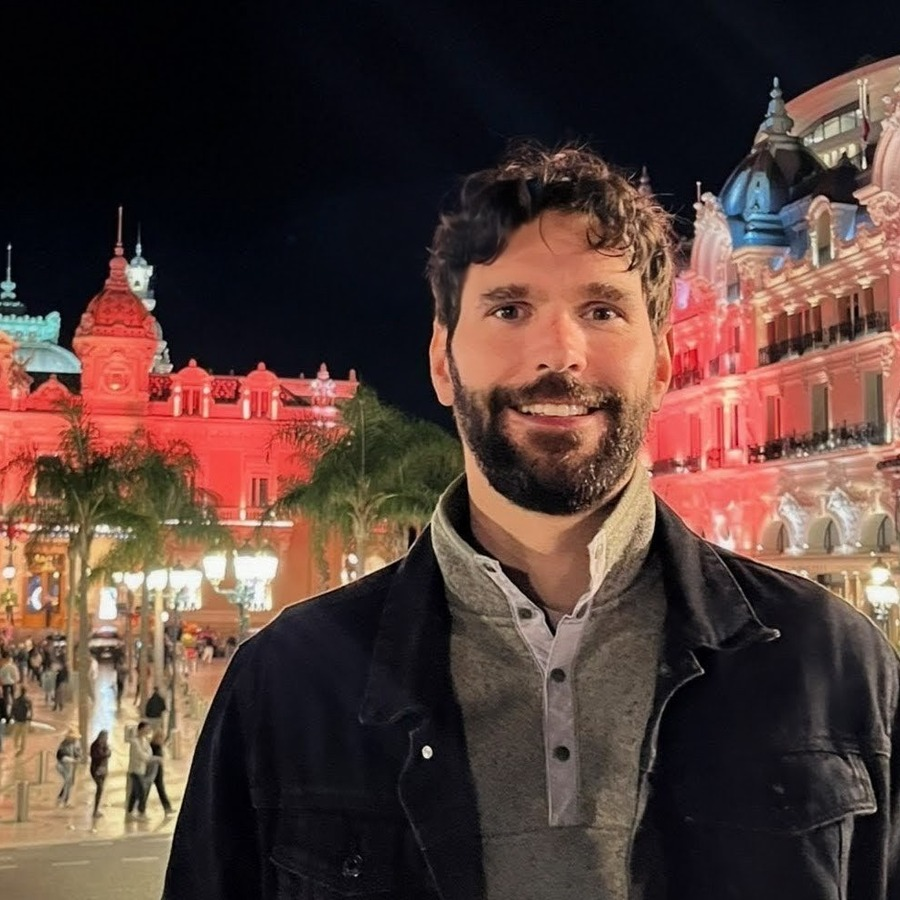

::: {.hero}
::: {.hero-text}
# Steffen Castle

## Researcher, DFKI Berlin · PhD Student, TU Berlin

**Explainable AI · Mechanistic Interpretability · Reliable Language Models**

I study how language models use information internally, and how those internal signals can be used to detect failures such as contextual hallucinations in retrieval-augmented generation.

::: {.hero-buttons}
[Research](research.qmd){.btn .btn-primary}
[Projects](projects.qmd){.btn .btn-secondary}
[Contact](contact.qmd){.btn .btn-secondary}
:::
:::

::: {.hero-photo}
{fig-alt="Portrait of Steffen Castle"}
:::
:::

::: {.affiliations}
::: {.affiliation}
**DFKI Berlin**  
German Research Center for Artificial Intelligence
:::

::: {.affiliation}
**TU Berlin**  
PhD student
:::

::: {.affiliation}
**Software Campus Fellow**  
Industry partner: **Celonis**
:::

::: {.affiliation}
**AI Grid Germany**  
German delegation, AI for Science Summer School Paris 2026
:::
:::

## Research story

::: {.timeline}
::: {.timeline-item}
**2019–2020**  
**Improving neural network explanations**  
Master's research on Pattern-Guided Attribution and Pattern-Guided Integrated Gradients.
:::

::: {.timeline-item}
**2021**  
**Using explanations for drift detection**  
Explanation signals as operational tools for detecting covariate shift.
:::

::: {.timeline-item}
**2024–present**  
**PhD: explanations as signals to improve AI systems**  
Using model explanations for evaluation, monitoring, and reliability.
:::

::: {.timeline-item}
**Current**  
**Mechanistic grounding and hallucination detection**  
Detecting unsupported RAG answers from source-specific residual-stream writes.
:::
:::

## Highlights

::: {.cards}
::: {.card}
### EMNLP 2026
Training-free character-length control in summarization with masked diffusion LMs (DELTA).

[Project page →](projects.qmd#delta)
:::

::: {.card}
### BlackboxNLP 2026
Decomposing the attention write by source to detect contextual hallucinations in RAG.

[Project page →](projects.qmd#source-writes)
:::

::: {.card}
### Software Campus
Explainability-driven AI reliability with industry partner **Celonis**.

[Research agenda →](research.qmd#software-campus)
:::

::: {.card}
### Publications
Work on diffusion LMs, hallucination detection, explainability, drift detection, and LLM-based entity linking.

[Publications →](publications.qmd)
:::

::: {.card}
### Collaboration
Open to collaborations on grounded language models, AI-for-science workflows, and mechanistic interpretability.

[Get in touch →](contact.qmd)
:::
:::
